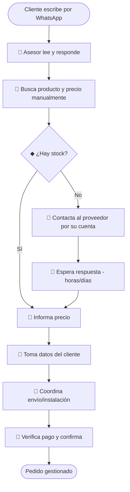
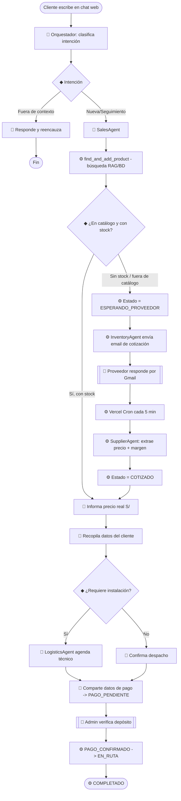

# §3.2 — Diagrama de proceso (BPMN as-is / to-be)

> Sección 3.2 del *Documento de Diseño*. Los diagramas delimitan qué pasos **automatiza
> el LLM**, cuáles permanecen **deterministas** y dónde hay **intervención humana**.
> Están en Mermaid (renderizan en GitHub); para el documento final se pueden exportar a
> BPMN 2.0 estricto con [bpmn.io](https://bpmn.io) conservando la misma semántica.

## Leyenda

| Marca | Significado |
|-------|-------------|
| 🤖 LLM | Paso ejecutado por un agente con modelo de lenguaje |
| ⚙️ det | Paso determinista (regla, BD, regex, envío de correo) |
| 🧑 humano | Intervención humana (admin o proveedor) |
| ◆ gateway | Decisión / bifurcación |

## Proceso AS-IS (manual, pre-IA)

**Problemas del as-is:** todo depende de un asesor humano; tiempos muertos esperando al
proveedor; sin trazabilidad; no escala con el volumen (2,400 consultas/mes, §7.2).

## Proceso TO-BE (con agentes de IA)

## Delimitación LLM / determinista / humano

| Paso | Tipo | Componente |
|------|------|-----------|
| Clasificar intención | 🤖 LLM (salida zod) | `orchestratorAgent` |
| Conversación de ventas y recopilación de datos | 🤖 LLM (LangGraph) | `salesAgent` |
| Búsqueda/agregado de producto | ⚙️ det (BD + RAG) | `find_and_add_product` |
| Consulta técnica | 🤖 LLM + ⚙️ RAG | `rag_query` (pgvector) |
| Envío de cotización al proveedor | ⚙️ det (Gmail) | `inventoryAgent` |
| **Respuesta del proveedor** | 🧑 humano | correo Gmail |
| Emparejar respuesta y extraer precio | ⚙️ det (cron + regex + margen) | `supplierAgent` |
| Coordinación logística / instalación | 🤖 LLM + ⚙️ tools | `logisticsAgent` |
| **Verificación del depósito** | 🧑 humano | panel admin |
| Transiciones de estado | ⚙️ det (guardado + guardrails) | `update_order_status` |

## Puntos de intervención humana (HITL, §3.5)

1. **Proveedor** responde el correo de cotización (asíncrono, fuera del sistema).
2. **Admin** verifica el depósito antes de pasar a `PAGO_CONFIRMADO` (control de alto
   impacto: dinero). Punto natural para un *interrupt* de LangGraph si se migra la
   memoria del grafo a un checkpointer durable.

> El to-be automatiza toda la conversación y la coordinación, dejando al humano solo las
> dos decisiones de alto impacto/externas. Esto ataca directamente los tiempos muertos y
> la no-escalabilidad del as-is.
